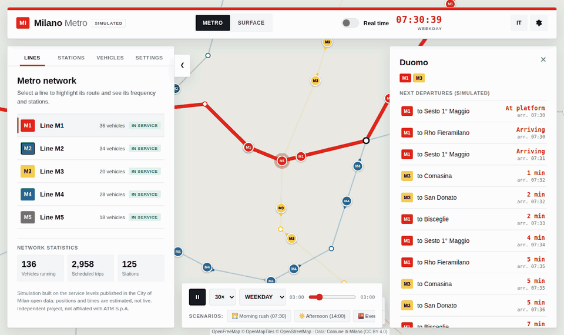
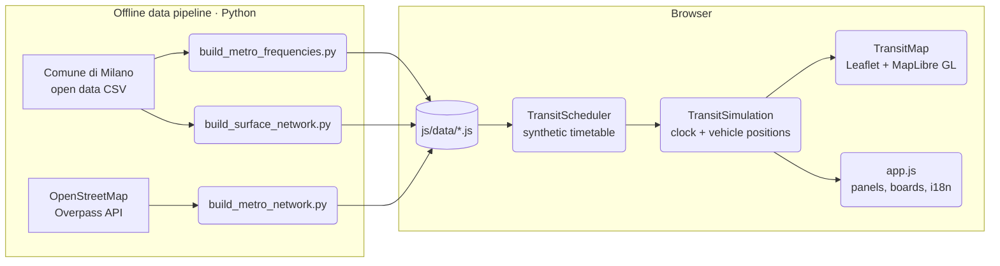
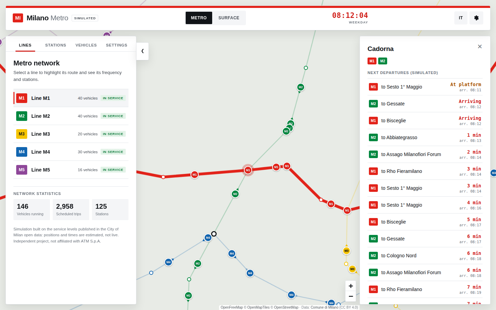
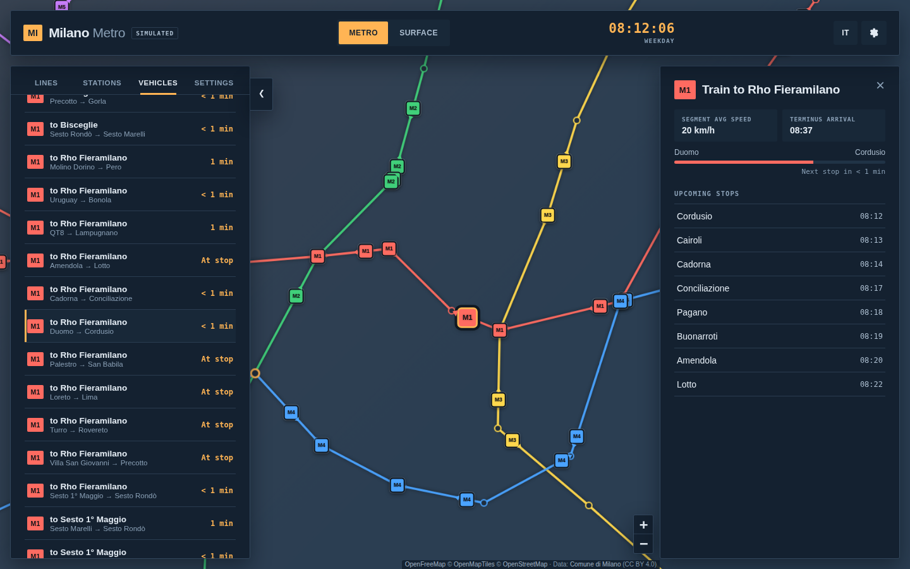
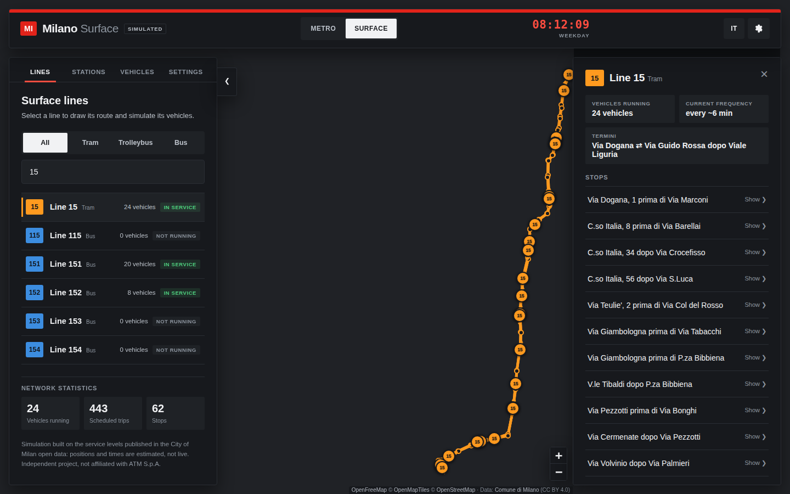
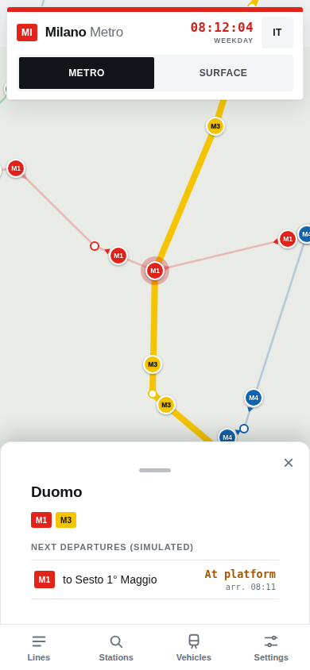

# Milano Transit Simulator


[](https://github.com/DeveloperMatt02/milano-transit-simulator/actions/workflows/ci.yml)


> An interactive map that simulates Milan's public transport network (metro lines M1–M5, trams, trolleybuses and buses) in real time, using the service levels published in the **City of Milan open data**.

**[▶ Live demo](https://developermatt02.github.io/milano-transit-simulator/)** · **[Time-travel mode](https://developermatt02.github.io/milano-transit-simulator/?simulation)** · [Versione italiana](https://developermatt02.github.io/milano-transit-simulator/?lang=it)



## 🚀 Overview

ATM does not publish real-time vehicle positions as open data. What *is* public is a summary of every route: how many trips run in the peak, off-peak and evening bands, and when the first and last runs are. **Milano Transit Simulator** turns those numbers into a synthetic, deterministic timetable and animates every vehicle on a map, so you can see what the network looks like at 08:00 on a weekday, at 00:30 on a Saturday night, or right now.

Everything runs in the browser: there is no backend, no API key and no build step. The base map comes from [OpenFreeMap](https://openfreemap.org), an open, key-free vector tile service built on OpenStreetMap. The whole app is a static site served by GitHub Pages.

> ⚠️ **Positions are simulated, not live.** This is an independent portfolio project and is not affiliated with ATM S.p.A.

### Key features

1. **Real-time simulation** — the simulation clock follows the current time in Milan (whatever your time zone), including the right timetable for weekdays, Saturdays, Sundays and Italian public holidays (Easter Monday and Milan's patron saint included).
2. **Branching lines** — M1 (Rho Fieramilano / Bisceglie) and M2 (Gessate / Cologno Nord, Assago / Abbiategrasso) alternate trains between their branches.
3. **Surface network** — 142 tram, trolleybus and bus lines and 4,690 stops, filterable by mode and searchable.
4. **Departure boards** — click any station or stop for the next simulated departures, grouped by line and destination.
5. **Vehicle tracking** — follow a train or bus: current segment, average speed, terminus arrival and upcoming stops.
6. **Time travel** — with `?simulation` in the URL you can pause, play at up to 60×, pick a day type and jump to preset scenarios (morning rush, after midnight…).
7. **Bilingual UI** — Italian and English, switchable at runtime (`?lang=it` / `?lang=en`).
8. **Three visual styles** — *Noorda* light and dark, inspired by Bob Noorda's 1964 wayfinding for the Milan metro, and *Fiord*, a control-room look. *Automatic* follows the device's light/dark setting.
9. **Built for phones** — bottom tab bar, draggable bottom sheets with snap points, 44 px touch targets and safe-area support; two-panel layout on tablets.
10. **Accessible** — WCAG AA contrast for text and line badges (checked by a unit test), keyboard navigation, visible focus and reduced motion.

## 🧠 Architecture



The scheduler turns service levels into stop-by-stop trips, the simulation computes where every vehicle is at a given second, and the UI renders the map at 60 fps while refreshing panels four times per second. See [ARCHITECTURE.md](docs/ARCHITECTURE.md) for the details.

## 🛠️ Tech stack

* **Frontend:** vanilla JavaScript (no framework, no bundler), HTML, CSS
* **Maps:** [Leaflet](https://leafletjs.com/) for the network layers, [MapLibre GL JS](https://maplibre.org/) (via [maplibre-gl-leaflet](https://github.com/maplibre/maplibre-gl-leaflet)) for the [OpenFreeMap](https://openfreemap.org) vector base map, with an OpenStreetMap raster fallback when WebGL is unavailable
* **Data pipeline:** Python 3 (standard library only)
* **Testing:** Node.js built-in test runner (`node:test`) and Python `unittest`
* **CI/CD:** GitHub Actions (tests on every push, automatic deploy to GitHub Pages)

## 📖 Documentation

* [Architecture](docs/ARCHITECTURE.md) — modules, data flow, rendering loop, state
* [Technical design](docs/TECHNICAL_DESIGN.md) — datasets, timetable synthesis, service-day model, assumptions and limitations

## 🚦 Getting started

### Run locally

No installation is needed. Clone the repository and open `index.html`, or serve the folder:

```bash
git clone https://github.com/DeveloperMatt02/milano-transit-simulator.git
cd milano-transit-simulator
python3 -m http.server 8000   # or: npm start
```

Then open <http://localhost:8000>. An internet connection is required for the map tiles, the map libraries and the web fonts.

### URL parameters

| Parameter | Effect |
| --- | --- |
| `?simulation` | Shows the time controls: real-time toggle, play/pause, speed (1×–60×), day type and timeline |
| `?lang=it` / `?lang=en` | Forces the interface language (otherwise the browser language is used and the choice is remembered) |

### Run the tests

```bash
npm test                                           # JavaScript: data integrity, scheduler, simulation, i18n
python3 -m unittest discover -s tests/python -v    # Python: data pipeline helpers
```

### Rebuild the datasets (optional)

The generated files in `js/data/` are committed, so this is only needed to refresh the data.

```bash
python3 scripts/download_open_data.py     # -> data/raw/ (git-ignored)
python3 scripts/build_metro_network.py    # -> js/data/metro-network.js
python3 scripts/build_metro_frequencies.py  # -> js/data/metro-frequencies.js
python3 scripts/build_surface_network.py  # -> js/data/surface-network.js
```

## 📂 Project structure

```text
milano-transit-simulator/
├── index.html                  # Single page: map, header, side panels, timeline
├── css/style.css               # Design system, light/dark themes, responsive layout
├── js/
│   ├── utils.js                # Geo maths, service-day time, holidays, escaping
│   ├── i18n.js                 # Italian / English dictionaries
│   ├── audio.js                # Synthesised UI sounds (Web Audio API)
│   ├── themes.js               # Noorda light/dark and Fiord: base map style, line colours
│   ├── sheet.js                # Draggable bottom sheets for phones
│   ├── scheduler.js            # Service levels -> stop-by-stop timetable
│   ├── simulation-engine.js    # Clock, vehicle positions, departure boards
│   ├── map-engine.js           # Base map, network layers and markers
│   ├── app.js                  # UI controller
│   └── data/                   # Generated datasets (metro network, frequencies, surface network)
├── scripts/                    # Python data pipeline
├── tests/
│   ├── js/                     # node:test suites
│   └── python/                 # unittest suites
├── docs/                       # Architecture, technical design, screenshots
└── .github/workflows/          # CI and GitHub Pages deployment
```

## 📸 Screenshots

| Noorda (light) | Fiord |
| --- | --- |
|  |  |

| Noorda (dark) · surface line | Phone |
| --- | --- |
|  |  |

## 📊 Data sources & attribution

* **Timetable summaries, surface stops and routes:** [Comune di Milano – Open Data](https://dati.comune.milano.it), licensed under [CC BY 4.0](https://creativecommons.org/licenses/by/4.0/) (timetable *INV2024-2025*).
* **Metro station coordinates:** © [OpenStreetMap](https://www.openstreetmap.org/copyright) contributors, [ODbL](https://opendatacommons.org/licenses/odbl/).
* **Basemap:** [OpenFreeMap](https://openfreemap.org) © [OpenMapTiles](https://www.openmaptiles.org/), data © OpenStreetMap contributors.

## ⚠️ Limitations

The simulation reproduces *service levels*, not the real timetable: trains are evenly spaced within each time band, running times are estimated from the distance between stations, and there are no delays, disruptions or short-turn services. Surface routes are drawn as straight lines between stops. See [Technical design § Assumptions](docs/TECHNICAL_DESIGN.md#7-assumptions-and-limitations).

## 👤 Author

Developed by **Matteo Trossi** — [@DeveloperMatt02](https://github.com/DeveloperMatt02)

## 📄 License

The source code is released under the MIT License — see [LICENSE](LICENSE). Datasets remain subject to their original licenses (CC BY 4.0 and ODbL).
