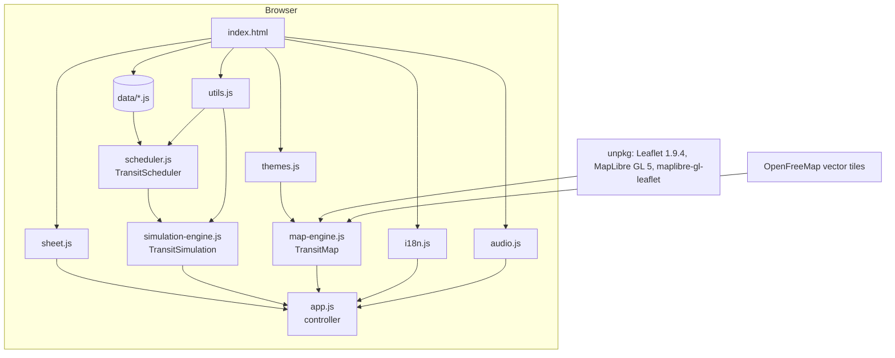
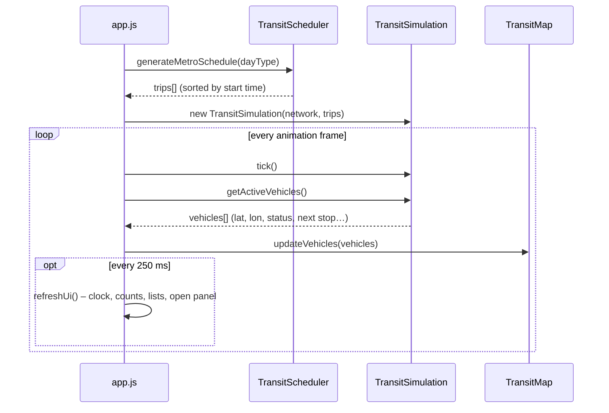

# Architecture

**Project:** Milano Transit Simulator
**Type:** static single-page web application + offline Python data pipeline

---

## Table of contents

1. [System overview](#1-system-overview)
2. [Runtime modules](#2-runtime-modules)
3. [Data flow](#3-data-flow)
4. [Application state](#4-application-state)
5. [Rendering loop](#5-rendering-loop)
6. [Map layer](#6-map-layer)
7. [Internationalisation](#7-internationalisation)
   - [Themes and responsive layout](#themes-and-responsive-layout)
8. [Data pipeline](#8-data-pipeline)
9. [Testing and CI/CD](#9-testing-and-cicd)
10. [Design decisions](#10-design-decisions)

---

## 1. System overview

The application has two independent halves:

| Half | Runs | Technology | Output |
| --- | --- | --- | --- |
| **Data pipeline** | Offline, on demand | Python 3, standard library only | `js/data/*.js` (committed) |
| **Web app** | In the browser | Vanilla JS, Leaflet, MapLibre GL, CSS | Interactive map |

There is no server: GitHub Pages serves the static files and the browser does all the work. The datasets are plain JavaScript files that declare a global constant (`const METRO_NETWORK = {...}`), so the page also works when opened directly from disk (`file://`), where `fetch()` of local JSON would be blocked by the browser.



## 2. Runtime modules

Scripts are loaded in dependency order with classic `<script>` tags (no bundler). Each module is wrapped in an IIFE and exposes a single global (`window.TransitScheduler`, …); when loaded by Node.js the same file exports it through `module.exports`, which is how the test-suite imports it.

| File | Global | Responsibility |
| --- | --- | --- |
| `js/utils.js` | `TransitUtils` | Haversine distance, bearing, `HH:MM` parsing, service-day time conversion, Italian holiday calendar and day type, HTML escaping, safe `localStorage` wrapper |
| `js/i18n.js` | `I18N` | Italian/English dictionaries, `t(key, params)` with plural forms, `data-i18n*` attribute binding, language persistence |
| `js/audio.js` | `UiSounds` | Short synthesised UI sounds (Web Audio API), can be muted |
| `js/themes.js` | `ThemeManager` | Theme preference (auto / Noorda light / Noorda dark / Fiord), system dark-mode tracking, base map style and line colours per theme |
| `js/sheet.js` | `BottomSheet` | Draggable bottom sheet with snap points (peek, half, full) and swipe-to-close, active only on phones |
| `js/scheduler.js` | `TransitScheduler` | Converts service levels into stop-by-stop trips for the metro and surface lines; caches surface schedules |
| `js/simulation-engine.js` | `TransitSimulation` | Simulation clock (real-time or manual, speed, wrap-around), vehicle state solver, departure boards |
| `js/map-engine.js` | `TransitMap` | Leaflet map, OpenFreeMap base map through MapLibre GL (raster fallback), metro network, selected surface line, vehicle markers, selection highlight, panel-aware camera |
| `js/app.js` | – | Controller: state, rendering loop, panels, search, view switching, time controls, theme/sound/language toggles |

## 3. Data flow



* **Metro:** the full-day timetable (≈3,000 trips on a weekday) is generated once at start-up and again only when the day type changes (at 03:00 in real-time mode, or when the user picks a different day in simulation mode).
* **Surface:** the timetable of a line is generated lazily when the line is selected or when a departure board needs it, and cached per `(line, day type)`. Vehicle counts for the line list use a cheaper path that only needs departure times and the route duration, so the 142-row list never builds full timetables.

## 4. Application state

`app.js` keeps a single state object:

```js
{
  view: "metro" | "surface",
  dayType: "L" | "S" | "F",          // weekday, Saturday, Sunday/holiday
  panel: null | { type: "line" | "station" | "vehicle", id },
  trackedTripId, highlightedLineId, surfaceLineId,
  surfaceFilter: "ALL" | "TRAM" | "FILOBUS" | "BUS",
  surfaceQuery, vehicles, lastUiRefresh
}
```

The simulation owns the time state (`simTime`, `isRealTime`, `isPlaying`, `speed`). User preferences (language, theme, sound) are stored in `localStorage` through a wrapper that silently degrades when storage is unavailable.

## 5. Rendering loop

A naïve implementation that rebuilds every panel on every animation frame destroys and recreates DOM nodes 60 times per second: hover states flicker and clicks get lost when the element under the pointer is replaced between `mousedown` and `mouseup`. The loop is therefore split:

| Work | Frequency | Technique |
| --- | --- | --- |
| Clock tick, vehicle positions, map markers | every frame (`requestAnimationFrame`) | markers are moved with `setLatLng`; the icon is rebuilt only when status, tracking or heading changes |
| Clock text, statistics, line counts, lists, open panel | every 250 ms | `setHtml()` writes `innerHTML` only when the markup actually changed |
| Panel skeleton | when the panel opens or the language changes | live values are patched into `[data-live]` slots |

All list interactions use **event delegation** on stable containers (`#lines-container`, `#active-vehicles-list`, `#right-panel-content`), so re-rendering a list never detaches its click handlers.

## 6. Map layer

The base map is an OpenFreeMap vector style (Positron, Dark or Fiord, depending on the theme) rendered by MapLibre GL inside Leaflet's tile pane through the `maplibre-gl-leaflet` adapter. If WebGL is missing, or the style does not load within a few seconds, the map switches to raster OpenStreetMap tiles (darkened with a CSS filter for the dark themes).

On top of it, `TransitMap` owns three Leaflet layer groups:

* `metroLayer` – polylines for every path of every line plus station markers (interchanges drawn in white);
* `surfaceLayer` – the currently selected surface line (routes and stops), cleared when another line is selected;
* `vehicleLayer` – vehicle markers keyed by trip id.

Line colours, weights and filters come from the active theme; switching theme redraws the network and rebuilds the vehicle icons. Attribution (OpenFreeMap, OpenMapTiles, OpenStreetMap, Comune di Milano) is always visible, and the bottom-right controls slide aside when the detail panel or the timeline is open. `focusOn()` accepts the area covered by the floating panels and offsets the map centre accordingly, so the selected station or vehicle is centred in the *visible* part of the map on both desktop and mobile.

## 7. Internationalisation

* Static markup declares keys with `data-i18n`, `data-i18n-placeholder`, `data-i18n-title` and `data-i18n-aria-label`.
* Dynamic markup calls `t("key", { param })`; plural entries are objects `{ one, other }`.
* The language is chosen from `?lang=`, then the saved preference, then `navigator.language`, falling back to English.
* On change, `I18N.apply()` re-translates the static markup and `app.js` re-renders the dynamic parts.
* Station and stop names are proper nouns and are never translated.

A test (`tests/js/i18n.test.js`) checks that both dictionaries have the same keys and that every key used in `index.html` and `app.js` exists.

### Themes and responsive layout

* **Themes.** Interface colours, fonts, radii and marker styles are CSS custom properties defined per `[data-theme]` in `css/style.css`. A tiny inline script in `index.html` applies the saved theme before the first paint; `ThemeManager` then keeps it in sync with the settings panel and, in *Automatic* mode, with `prefers-color-scheme`.
* **Desktop (> 1024 px).** Header, left sidebar with four tabs (lines, stations, vehicles, settings), right detail panel and, in simulation mode, a timeline between them.
* **Tablet (701–1024 px).** Same structure with narrower panels; opening a station or vehicle collapses the sidebar so the map stays visible.
* **Phone (≤ 700 px).** Compact two-row header, a bottom tab bar, and both panels become bottom sheets. The sidebar sheet snaps to half or full height; the detail sheet also has a *peek* height so the map stays visible while a departure board is open. Dragging a sheet below its lowest snap closes it. The camera offsets the map centre by the height of the open sheet.

## 8. Data pipeline

```text
scripts/
├── common.py                   # paths, HH:MM helpers, service-day conversion, JS writer
├── download_open_data.py       # CSVs from dati.comune.milano.it + stations from Overpass -> data/raw/
├── build_metro_network.py      # line topology (hand-written) + OSM coordinates -> metro-network.js
├── build_metro_frequencies.py  # tpl_metroorari.csv -> metro-frequencies.js
└── build_surface_network.py    # tpl_fermate/sequenza/orari.csv -> surface-network.js
```

Raw files are git-ignored; generated files are committed so that the site needs no build step. The surface dataset is written as compact JSON (≈0.7 MB instead of 1.3 MB). See [TECHNICAL_DESIGN.md](TECHNICAL_DESIGN.md#2-datasets) for the schemas.

## 9. Testing and CI/CD

| Suite | Runner | Covers |
| --- | --- | --- |
| `tests/js/network.test.js` | `node:test` | Dataset integrity: stations referenced by paths exist, coordinates inside Milan, branch junctions, inter-station distances, frequency ranges, surface stops |
| `tests/js/scheduler.test.js` | `node:test` | Time bands, headways, monotonic stop times, service window, branch alternation, day types, surface caching and counting |
| `tests/js/simulation.test.js` | `node:test` | After-midnight service, interpolation, clock wrap-around, departure boards |
| `tests/js/utils.test.js` | `node:test` | Geo helpers, time conversion, Easter and holidays, escaping |
| `tests/js/i18n.test.js` | `node:test` | Dictionary parity and key coverage |
| `tests/js/themes.test.js` | `node:test` | Theme resolution, OpenFreeMap styles, WCAG AA contrast of every line badge |
| `tests/python/test_pipeline.py` | `unittest` | Time normalisation, frequency aggregation, 24-hour and night routes, network builder |

GitHub Actions runs both suites on every push and pull request (`.github/workflows/ci.yml`) and deploys the site to GitHub Pages on every push to `main` (`.github/workflows/pages.yml`).

## 10. Design decisions

| Decision | Rationale |
| --- | --- |
| Vector base map from OpenFreeMap | Open data, no API key or account, no usage fees; styles that match each theme |
| No framework, no bundler | The UI is small; zero build keeps the project easy to run (double-click `index.html`) and to host |
| Data as JS globals instead of JSON | Works from `file://` without a local server |
| Stateless vehicle positions | Position is a pure function of `(trip, time)`: scrubbing the timeline or running at 60× needs no incremental state and cannot drift |
| Service-day time (03:00 → 27:00) | Late-night trips stay on the same timeline as the rest of the day instead of vanishing at midnight |
| Deterministic timetable | The same input always gives the same trains, which keeps the app testable |
